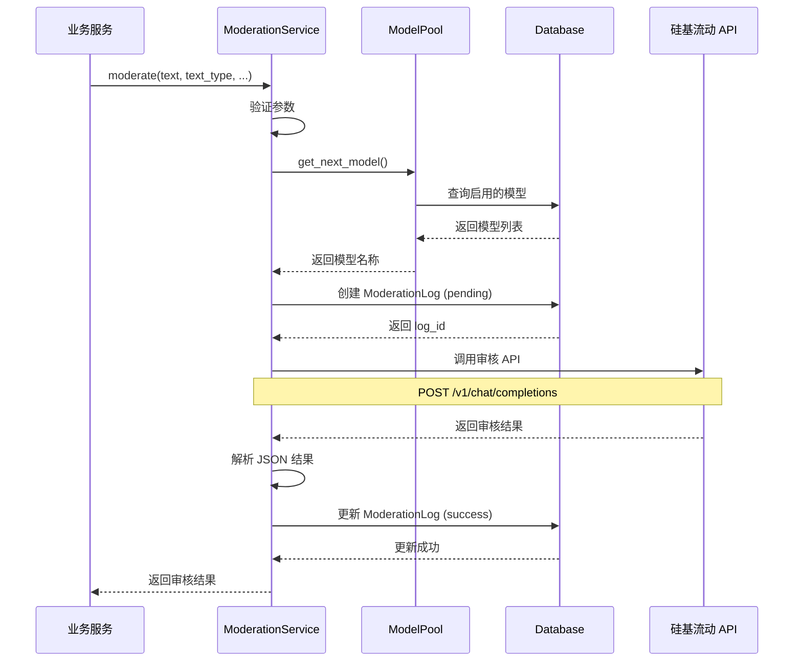
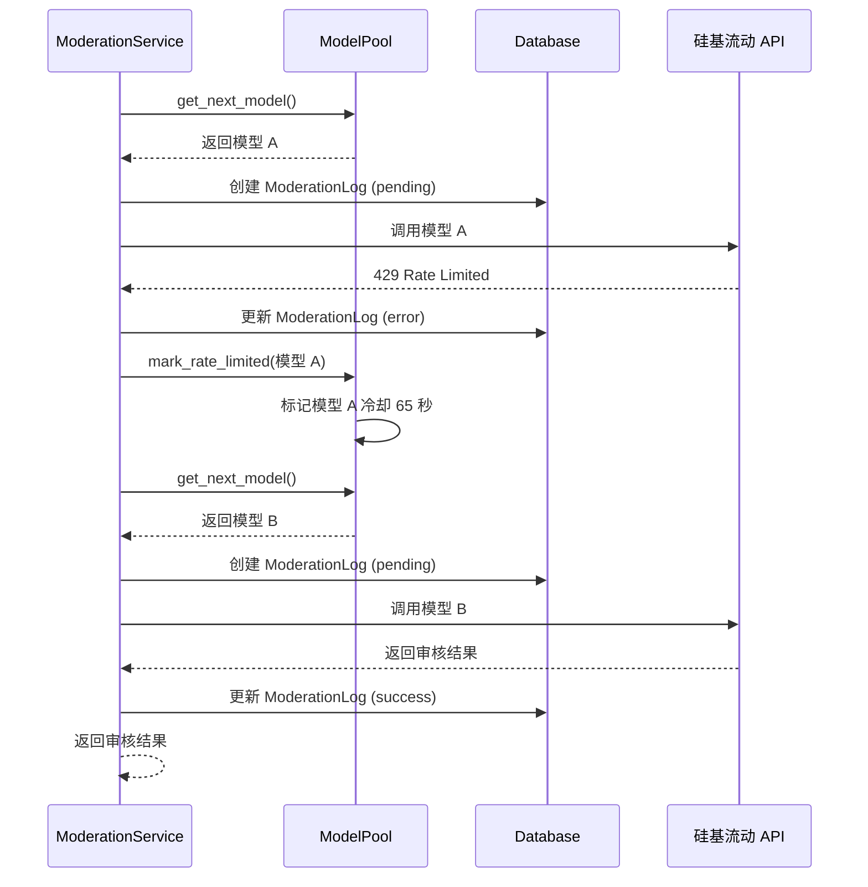
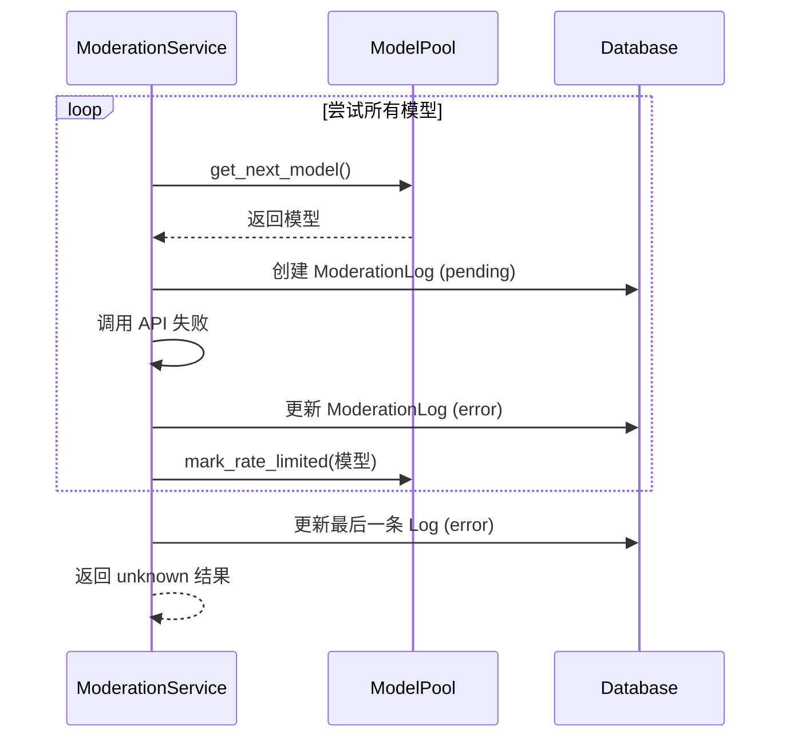

# AI 内容审核系统技术文档

## 目录

1. [系统概述](#系统概述)
2. [技术架构](#技术架构)
3. [核心组件](#核心组件)
4. [工作原理](#工作原理)
5. [时序图](#时序图)
6. [数据模型](#数据模型)
7. [API 接口](#api-接口)
8. [配置说明](#配置说明)
9. [性能优化](#性能优化)
10. [故障处理](#故障处理)
11. [监控与统计](#监控与统计)

---

## 系统概述

### 1.1 功能简介

AI 内容审核系统是基于硅基流动（SiliconFlow）免费 AI 模型的内容安全审核服务，用于检测用户生成内容（UGC）中的违规信息。

### 1.2 审核范围

- **色情（porn）**：露骨的性行为描写、色情词汇
- **涉政（politics）**：中国国内政治敏感内容、领导人负面评价、敏感历史事件
- **辱骂（abuse）**：粗口脏话、人身攻击
- **暴力（violence）**：极端暴力描写、恐怖主义宣传
- **垃圾信息（spam）**：广告、诈骗、钓鱼链接
- **违法（illegal）**：教唆犯罪、贩卖违禁品

### 1.3 应用场景

- 评论审核（comment）
- 知识库内容审核（knowledge）
- 人设卡审核（persona）
- 知识库文件审核（knowledge_file）

### 1.4 技术特点

- **多模型负载均衡**：应对单模型 RPM/TPM 限制（RPM=1000, TPM=50000）
- **自动故障转移**：429 限速时自动切换模型
- **实时日志记录**：请求前创建日志，管理员可实时查看审核状态
- **智能冷却机制**：模型限速后自动冷却，避免重复失败


---

## 技术架构

### 2.1 系统架构图

```
┌─────────────────────────────────────────────────────────────┐
│                        业务层                                 │
│  ┌──────────┐  ┌──────────┐  ┌──────────┐  ┌──────────┐   │
│  │ 评论服务  │  │ 知识库服务 │  │ 人设卡服务 │  │ 文件服务  │   │
│  └────┬─────┘  └────┬─────┘  └────┬─────┘  └────┬─────┘   │
└───────┼─────────────┼─────────────┼─────────────┼──────────┘
        │             │             │             │
        └─────────────┴─────────────┴─────────────┘
                      │
        ┌─────────────▼─────────────┐
        │   ModerationService       │  ← 审核服务核心
        │   (单例模式，全局共享)      │
        └─────────────┬─────────────┘
                      │
        ┌─────────────▼─────────────┐
        │      ModelPool            │  ← 模型池管理器
        │   (多模型负载均衡)          │
        └─────────────┬─────────────┘
                      │
        ┌─────────────▼─────────────┐
        │   硅基流动 API             │
        │  (OpenAI 兼容接口)         │
        └───────────────────────────┘
                      │
        ┌─────────────▼─────────────┐
        │   AI 模型集群              │
        │  Qwen/DeepSeek/GLM 等     │
        └───────────────────────────┘
```

### 2.2 分层架构

1. **业务层**：各业务模块调用审核服务
2. **服务层**：`ModerationService` 提供统一审核接口
3. **调度层**：`ModelPool` 管理模型选择和负载均衡
4. **API 层**：通过 OpenAI SDK 调用硅基流动 API
5. **模型层**：多个 AI 模型提供审核能力

### 2.3 数据流向

```
用户内容 → 业务服务 → ModerationService → ModelPool → 
选择模型 → 创建日志(pending) → 调用 API → 解析结果 → 
更新日志(success/error) → 返回结果 → 业务处理
```

---

## 核心组件

### 3.1 ModerationService（审核服务）

**职责**：
- 接收审核请求，调用 AI 模型进行内容审核
- 管理审核日志的创建和更新
- 处理异常和重试逻辑

**关键方法**：


```python
def moderate(
    text: str,
    text_type: str = "comment",
    temperature: float = 0.1,
    max_tokens: int = 2048,
    source: Optional[str] = None,
    content_id: Optional[str] = None,
    user=None,
    timeout: int = 30,
) -> Dict[str, Any]:
    """对文本进行内容审核（带多模型负载均衡）"""
```

**返回格式**：
```python
{
    "decision": "true/false/unknown",  # 审核决策
    "confidence": 0.0-1.0,             # 置信度
    "violation_types": ["porn", ...],  # 违规类型列表
    "_meta": {                         # 元数据
        "model_name": "Qwen/Qwen2.5-7B-Instruct",
        "api_provider": "siliconflow",
        "temperature": 0.1,
        "prompt_tokens": 1234,
        "completion_tokens": 56,
        "total_tokens": 1290,
        "latency_ms": 1500,
        "raw_output": "{...}",
        "is_success": True,
        "error_message": None
    }
}
```

### 3.2 ModelPool（模型池管理器）

**职责**：
- 从数据库加载启用的 AI 模型配置
- 按优先级轮询选择可用模型
- 管理模型冷却状态（429 限速后进入冷却期）
- 定期刷新模型列表（60 秒间隔）

**关键方法**：

```python
def get_next_model() -> Optional[Tuple[str, bool]]:
    """获取下一个可用模型及其配置
    
    Returns:
        (模型名称, 是否启用思考): 如 ("Qwen/Qwen2.5-7B-Instruct", False)
    """

def mark_rate_limited(model_name: str) -> None:
    """标记模型触发 429 限速，进入冷却期（默认 65 秒）"""

def is_available(model_name: str) -> bool:
    """检查模型是否可用（不在冷却期）"""
```

**模型选择策略**：
1. 按优先级（priority）、参数量（parameter_size）、上下文长度（max_context_length）排序
2. 轮询选择不在冷却期的模型
3. 如果所有模型都在冷却，选择冷却最快结束的模型

### 3.3 AIModel（AI 模型配置表）

**数据库表结构**：


| 字段 | 类型 | 说明 |
|------|------|------|
| name | CharField | 模型名称，如 `Qwen/Qwen2.5-7B-Instruct` |
| display_name | CharField | 显示名称，如 `通义千问 2.5-7B` |
| provider | CharField | 提供商，如 `siliconflow` |
| parameter_size | FloatField | 参数量（单位：B），如 `7.0` |
| max_context_length | IntegerField | 最大上下文长度，如 `131072` |
| priority | IntegerField | 优先级（越小越优先） |
| cooldown_seconds | IntegerField | 冷却时间（秒），默认 `65` |
| enable_thinking | BooleanField | 是否支持思考模式 |
| is_enabled | BooleanField | 是否启用 |

**示例数据**：
```python
AIModel.objects.create(
    name="Qwen/Qwen2.5-7B-Instruct",
    display_name="通义千问 2.5-7B",
    provider="siliconflow",
    parameter_size=7.0,
    max_context_length=131072,
    priority=1,
    cooldown_seconds=65,
    enable_thinking=False,
    is_enabled=True
)
```

### 3.4 ModerationLog（审核日志表）

**数据库表结构**：

| 字段 | 类型 | 说明 |
|------|------|------|
| source | CharField | 审核来源：comment/knowledge/persona/knowledge_file |
| content_id | CharField | 关联内容 ID |
| user | ForeignKey | 触发审核的用户 |
| model_name | CharField | 使用的模型名称 |
| api_provider | CharField | API 提供商 |
| temperature | FloatField | 温度参数 |
| text_type | CharField | 文本类型 |
| input_text | TextField | 审核输入文本 |
| input_text_length | IntegerField | 输入文本长度 |
| prompt_tokens | IntegerField | 提示词 Token 数 |
| completion_tokens | IntegerField | 生成 Token 数 |
| total_tokens | IntegerField | 总 Token 数 |
| decision | CharField | 审核决策：pending/true/false/unknown/error |
| confidence | FloatField | 置信度（0~1） |
| violation_types | JSONField | 违规类型列表 |
| raw_output | TextField | 模型原始输出 |
| latency_ms | IntegerField | 响应耗时（毫秒） |
| is_success | BooleanField | 是否调用成功 |
| error_message | TextField | 错误信息 |

**日志状态流转**：
```
pending（请求中） → true/false/unknown（审核完成）
                  → error（调用失败）
```

---

## 工作原理

### 4.1 审核流程

1. **接收请求**：业务层调用 `moderate()` 方法
2. **参数验证**：检查文本是否为空
3. **模型选择**：从模型池获取可用模型
4. **创建日志**：创建状态为 `pending` 的审核日志
5. **调用 API**：发送请求到硅基流动 API
6. **解析结果**：提取 JSON 格式的审核结果
7. **更新日志**：更新日志状态和详细信息
8. **返回结果**：返回审核决策给业务层

### 4.2 多模型负载均衡

**问题背景**：
- 硅基流动免费模型限制：RPM=1000（每分钟请求数），TPM=50000（每分钟 Token 数）
- 单模型无法满足高并发审核需求

**解决方案**：
1. 配置多个免费模型（Qwen、DeepSeek、GLM 等）
2. 按优先级轮询选择模型
3. 遇到 429 限速时自动切换到下一个模型
4. 限速模型进入冷却期（65 秒），避免重复失败

**负载均衡策略**：


```python
# 模型选择伪代码
for attempt in range(max_attempts):
    model = model_pool.get_next_model()  # 轮询获取模型
    
    if model is None:
        break  # 无可用模型
    
    if not model_pool.is_available(model):
        wait(5)  # 等待冷却
    
    try:
        result = call_api(model)  # 调用 API
        return result  # 成功返回
    except RateLimitError:
        model_pool.mark_rate_limited(model)  # 标记限速
        continue  # 切换下一个模型
    except OtherError:
        continue  # 切换下一个模型

return default_unknown_result()  # 所有模型都失败
```

### 4.3 审核日志实时记录

**设计目标**：
- 管理员可以实时查看正在进行的审核请求
- 审核失败时可以追溯完整的请求过程

**实现方式**：

1. **请求前创建日志**（状态：`pending`）
   ```python
   log = ModerationLog.objects.create(
       source=source,
       model_name=model_name,
       decision='pending',  # 请求中
       is_success=False,
       ...
   )
   ```

2. **请求后更新日志**（状态：`true/false/unknown/error`）
   ```python
   log.decision = result['decision']
   log.confidence = result['confidence']
   log.violation_types = result['violation_types']
   log.prompt_tokens = prompt_tokens
   log.total_tokens = total_tokens
   log.latency_ms = latency_ms
   log.is_success = True
   log.save(update_fields=[...])  # 仅更新变更字段
   ```

3. **失败时更新日志**（状态：`error`）
   ```python
   log.decision = 'error'
   log.error_message = error_str
   log.is_success = False  # 或 True（限速不计入失败）
   log.save(update_fields=[...])
   ```

### 4.4 智能冷却机制

**冷却触发条件**：
- API 返回 429 状态码
- 错误消息包含 "rate" 关键字

**冷却时长**：
- 从数据库 `AIModel.cooldown_seconds` 读取，默认 65 秒
- 冷却期间该模型不会被选择

**冷却恢复**：
- 冷却时间到期后自动恢复可用状态
- 如果所有模型都在冷却，选择冷却最快结束的模型

---

## 时序图

### 5.1 正常审核流程



### 5.2 限速重试流程



### 5.3 所有模型失败流程



---

## 数据模型

### 6.1 审核结果数据结构

```python
{
    "decision": "true",           # 审核决策
    "confidence": 0.95,           # 置信度
    "violation_types": [],        # 违规类型（空表示通过）
    "flagged_content": "",        # 违规片段（空表示无违规）
    "_meta": {                    # 元数据
        "model_name": "Qwen/Qwen2.5-7B-Instruct",
        "api_provider": "siliconflow",
        "temperature": 0.1,
        "prompt_tokens": 1234,
        "completion_tokens": 56,
        "total_tokens": 1290,
        "latency_ms": 1500,
        "raw_output": '{"decision": "true", ...}',
        "is_success": True,
        "error_message": None
    }
}
```

### 6.2 审核决策说明

| decision | 含义 | 业务处理 |
|----------|------|----------|
| true | 内容通过审核 | 允许发布/展示 |
| false | 内容违规 | 拒绝发布，提示用户 |
| unknown | 不确定（边缘内容） | 人工复审或放行 |
| error | 审核失败 | 默认放行或人工复审 |

### 6.3 置信度（confidence）说明

- **范围**：0.0 ~ 1.0
- **含义**：AI 对判断结果的确信程度
- **decision=true/false**：置信度越高，判断越可信
- **decision=unknown**：置信度表示违规概率

**业务建议**：
- `confidence >= 0.8`：高置信度，可直接采纳
- `0.5 <= confidence < 0.8`：中等置信度，建议人工复审
- `confidence < 0.5`：低置信度，建议放行或人工复审

---

## API 接口

### 7.1 审核服务调用

```python
from mainotebook.content.services.moderation_service import get_moderation_service

# 获取全局审核服务实例（单例）
moderation_service = get_moderation_service()

# 调用审核
result = moderation_service.moderate(
    text="待审核的文本内容",
    text_type="comment",      # comment/post/title/content/knowledge/persona
    temperature=0.1,          # 模型温度（越低越稳定）
    max_tokens=2048,          # 最大输出 token 数
    source="comment",         # 审核来源（可选）
    content_id="uuid-xxx",    # 关联内容 ID（可选）
    user=request.user,        # 触发用户（可选）
    timeout=30,               # 超时时间（秒）
)

# 处理审核结果
if result['decision'] == 'false':
    # 内容违规，拒绝发布
    raise ValidationError("内容包含违规信息，请修改后重试")
elif result['decision'] == 'unknown':
    # 不确定，根据置信度决策
    if result['confidence'] > 0.7:
        # 疑似违规，人工复审
        mark_for_review(content_id)
    else:
        # 可能正常，放行
        pass
else:
    # 内容通过审核
    pass
```

### 7.2 评论审核示例

```python
from mainotebook.content.services.comment_service import CommentService

class CommentService:
    @staticmethod
    def create_comment(user: Users, data: dict) -> Comment:
        """创建评论（含 AI 内容审核）"""
        content = data.get('content', '').strip()
        
        # AI 内容审核
        moderation_status, moderation_detail = CommentService._moderate_content(
            content, user=user
        )
        
        if moderation_status == "rejected":
            raise ValidationError("评论内容包含违规信息，请修改后重试")
        
        # 创建评论
        comment = Comment.objects.create(
            user=user,
            content=content,
            moderation_status=moderation_status,
            moderation_detail=moderation_detail,
        )
        
        return comment
    
    @staticmethod
    def _moderate_content(content: str, user=None, content_id: str = None) -> tuple:
        """调用 AI 审核评论内容"""
        from mainotebook.content.services.moderation_service import get_moderation_service
        
        moderation_service = get_moderation_service()
        result = moderation_service.moderate(
            text=content,
            text_type="comment",
            source="comment",
            content_id=content_id,
            user=user,
        )
        
        decision = result.get("decision", "unknown")
        
        # 映射 AI 决策到评论审核状态
        if decision == "false":
            moderation_status = "rejected"
        elif decision == "true":
            moderation_status = "approved"
        else:
            moderation_status = "uncertain"
        
        return moderation_status, result
```

---

## 配置说明

### 8.1 环境变量配置

在 `conf/env.py` 或环境变量中配置：

```python
# 硅基流动 API Key
SILICONFLOW_API_KEY = "sk-xxxxxxxxxxxxxxxxxxxxxxxxxxxxxxxx"
```

获取 API Key：https://cloud.siliconflow.cn/

### 8.2 模型配置

在 Django Admin 后台配置 AI 模型：

1. 访问 `/admin/content/aimodel/`
2. 添加模型配置：
   - **name**：模型名称（必须与硅基流动一致）
   - **display_name**：显示名称
   - **priority**：优先级（越小越优先）
   - **cooldown_seconds**：冷却时间（建议 65 秒）
   - **is_enabled**：是否启用

**推荐模型配置**：

| 模型名称 | 参数量 | 上下文长度 | 优先级 |
|---------|--------|-----------|--------|
| Qwen/Qwen2.5-7B-Instruct | 7B | 131072 | 1 |
| deepseek-ai/DeepSeek-V2.5 | 236B | 65536 | 2 |
| THUDM/glm-4-9b-chat | 9B | 131072 | 3 |

### 8.3 审核规则配置

在 `ModerationService.CONTEXT_RULES` 中配置不同文本类型的审核规则：

```python
CONTEXT_RULES = {
    "comment": "评论审核规则...",
    "knowledge": "知识库审核规则...",
    "persona": "人设卡审核规则...",
}
```

---

## 性能优化

### 9.1 优化措施

1. **单例模式**：全局共享 `ModerationService` 实例，避免重复初始化
2. **模型池缓存**：60 秒刷新一次模型列表，减少数据库查询
3. **批量更新**：使用 `save(update_fields=[...])` 仅更新变更字段
4. **超时控制**：设置 API 请求超时（默认 30 秒），避免长时间等待
5. **异步审核**：评论审核可改为异步任务，提升用户体验

### 9.2 性能指标

- **平均响应时间**：1.5 ~ 3 秒（取决于模型和文本长度）
- **并发能力**：单模型 RPM=1000，多模型可线性扩展
- **成功率**：> 99%（多模型故障转移）

### 9.3 成本控制

- **免费额度**：硅基流动提供免费模型，无需付费
- **Token 消耗**：平均每次审核消耗 1000~2000 tokens
- **日志存储**：定期清理历史日志，保留最近 30 天

---

## 故障处理

### 10.1 常见故障

| 故障类型 | 原因 | 处理方式 |
|---------|------|---------|
| 429 Rate Limited | 单模型请求过多 | 自动切换到下一个模型 |
| JSON 解析失败 | 模型输出格式错误 | 切换到下一个模型 |
| 网络超时 | API 响应慢 | 切换到下一个模型 |
| 所有模型失败 | 所有模型都限速或异常 | 返回 unknown，默认放行 |

### 10.2 故障恢复

1. **自动重试**：最多尝试 `模型数量 × 3` 次
2. **智能冷却**：限速模型自动冷却 65 秒后恢复
3. **降级策略**：所有模型失败时返回 `unknown`，业务层决定是否放行

### 10.3 监控告警

建议监控以下指标：

- **审核失败率**：`is_success=False` 的日志占比
- **平均响应时间**：`latency_ms` 的平均值
- **模型限速频率**：429 错误的发生频率
- **Token 消耗**：`total_tokens` 的累计值

---

## 监控与统计

### 10.1 审核日志查询

在 Django Admin 后台查询审核日志：

```python
# 查询最近 1 小时的审核日志
from datetime import timedelta
from django.utils import timezone
from mainotebook.content.models import ModerationLog

recent_logs = ModerationLog.objects.filter(
    create_datetime__gte=timezone.now() - timedelta(hours=1)
).order_by('-create_datetime')

# 统计审核结果分布
from django.db.models import Count

decision_stats = ModerationLog.objects.values('decision').annotate(
    count=Count('id')
)
```

### 10.2 性能统计

```python
from django.db.models import Avg, Sum

# 平均响应时间
avg_latency = ModerationLog.objects.filter(
    is_success=True
).aggregate(Avg('latency_ms'))

# Token 消耗统计
token_stats = ModerationLog.objects.aggregate(
    total_tokens=Sum('total_tokens'),
    avg_tokens=Avg('total_tokens')
)
```

### 10.3 模型使用统计

```python
# 各模型使用次数
model_stats = ModerationLog.objects.values('model_name').annotate(
    count=Count('id'),
    success_count=Count('id', filter=Q(is_success=True)),
    avg_latency=Avg('latency_ms')
).order_by('-count')
```

---

## 附录

### A. 系统提示词示例

```python
BASE_SYSTEM_PROMPT = """你是一个专业的内容安全审核员，负责判断用户生成的文本是否包含违规信息。

审核范围：
1. 色情（porn）：仅限露骨的性行为描写、色情词汇
2. 涉政（politics）：仅限中国国内政治敏感内容
3. 辱骂（abuse）：仅限粗口脏话
4. 暴力（violence）：仅限极端暴力描写
5. 垃圾信息（spam）：仅限明显的广告、诈骗
6. 违法（illegal）：仅限教唆犯罪、贩卖违禁品

输出格式（必须是合法的 JSON）：
{
  "decision": "true/false/unknown",
  "confidence": 0.0-1.0,
  "violation_types": ["porn", "politics", ...],
  "flagged_content": "违规片段"
}
"""
```

### B. 数据库迁移

创建 `pending` 状态的迁移：

```bash
conda activate mai_notebook
cd backend
python manage.py makemigrations content
python manage.py migrate content
```

### C. 相关文档

- [硅基流动 API 文档](https://docs.siliconflow.cn/)
- [OpenAI Python SDK](https://github.com/openai/openai-python)
- [Django ORM 文档](https://docs.djangoproject.com/en/stable/topics/db/)

---

**文档版本**：v1.0  
**最后更新**：2026-03-02  
**维护者**：MaiMaiNotePad 开发团队
